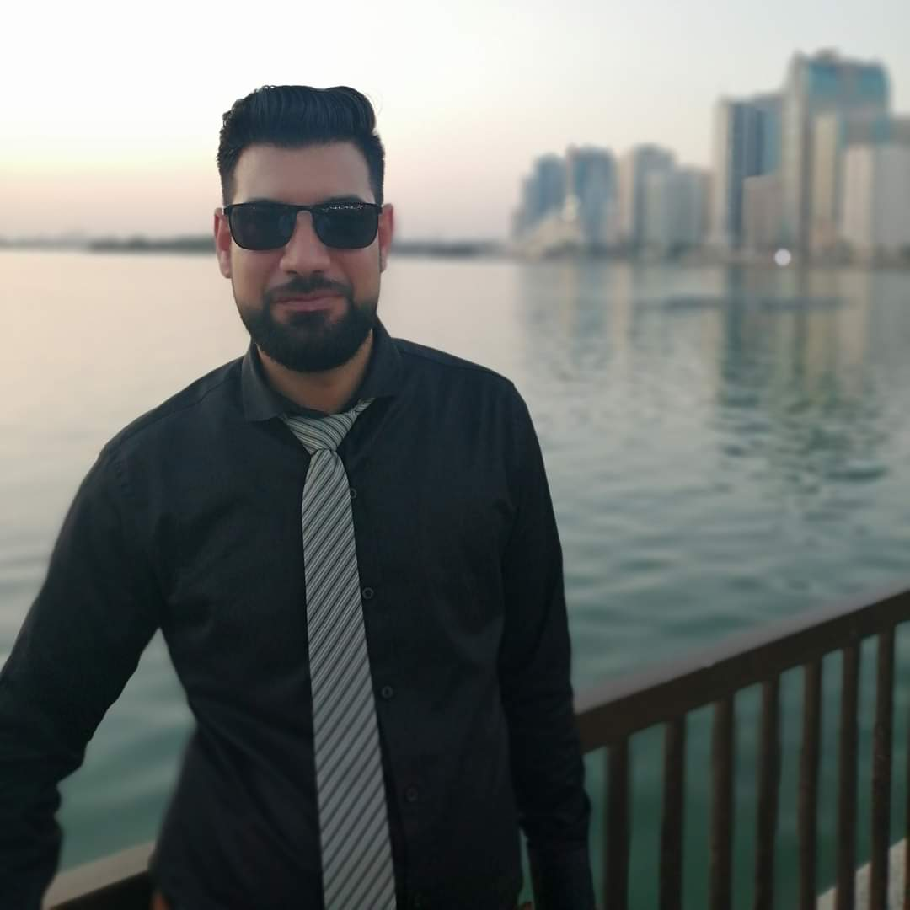
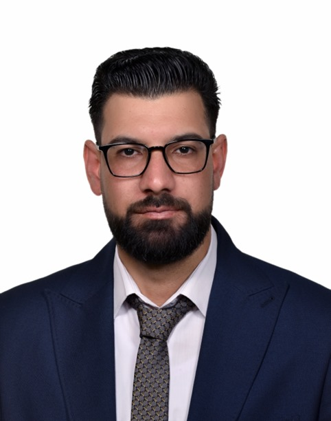

# Oalhenany Portfolio

**Oalhenany Portfolio** is a bilingual PHP website that presents Dr. Omran Al Henany's professional work, services, and background. It uses a responsive Bootstrap layout and integrates multiple data files to keep the content flexible and easy to update.

## Features
- Dynamic hero section with typed text effects
- Multilingual interface (Arabic/English)
- Responsive design powered by Bootstrap
- Search engine friendly metadata
- Lightweight admin page to edit profile data

## Recent Updates
- Improved WhatsApp SEO integration
- Added easy-to-edit data files for texts and portfolio items
- Enhanced RTL support for Arabic language
- Refreshed styles across all sections

## File Overview
- **index.php** – main entry page that assembles all sections.
- **config.php** – global configuration, language helpers and portfolio categories.
- **website_data.php** – labels and interface text used throughout the site.
- **user_data.php** – personal resume details and vision statements.
- **edit_user_data.php** – simple password protected editor for `user_data.php`.
- **portfolio-details.php** – displays portfolio galleries using data arrays.
- **default.php** – fallback page displayed if hosting is misconfigured.
- **assets/** – CSS, JavaScript and vendor libraries.
- **Pro/** – profile images including the ones shown above.
- **1/** – image folders for portfolio pieces.
- **favicon.ico** – site icon displayed in browser tabs.

## Get Started
Upload the project files to any PHP-enabled server. Update `user_data.php` and `website_data.php` to customize your information. Images for portfolio items live inside the `1/` directory and can be expanded as needed.

Stay tuned for further improvements and new portfolio entries!
